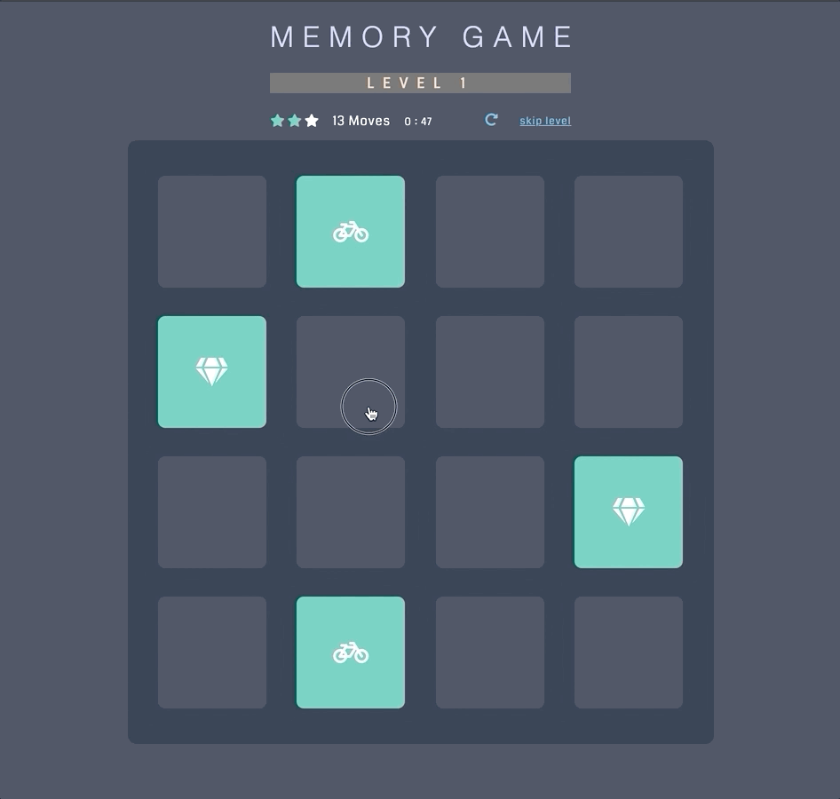

# Memory Game

The object of the game is to locate the matching pairs of cards in as few moves as possible.

Play the game: https://oriane212.github.io/memory-game/

## Dependencies
- `app.js`
- `app.css`
- Font Awesome icons (v5, CDN in `index.html`)
- Sounds in `audio` (sources listed in index.html)
- `dialog-polyfill.js` and `dialog-polyfill.css` (included from github.com/GoogleChrome/dialog-polyfill)

## How to run the game
1. Clone this repo
2. Open `index.html` file in browser
3. Play game!

## How to Play
Make a move by clicking two cards to flip them over.

## Game features
- 3 decks of cards, each its own level with its own styles
- score panel displaying the score, move count, and timer
- ability to restart a level (re-shuffle the card deck)
- ability to skip a level
- summary of final stats finishing each level
- sound effects with user interaction

## Customizable features
- Each level contains a customizable deck of cards created with Font Awesome icons
- Any number of levels can be added, each level corresponding with a list of Font Awesome icons added to the collection. 
 * **Note:** Styles for only 3 levels are included, so each level added will require a new set of styles (or logic for looping through styles).
- Score logic can be modified, including
  * number of stars each level starts out with
  * number of moves before score decreases
  * number of stars needed to advance to next level
